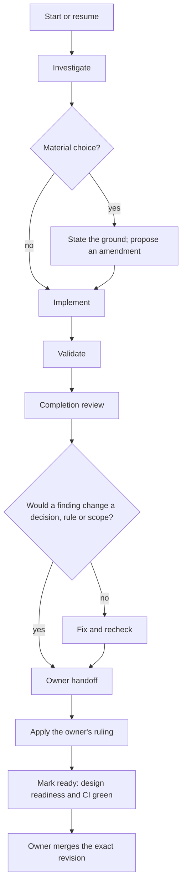

# Development workflow map

One page for the whole development loop: when each step happens, what it
produces, where that lives, and which rule, skill or check owns it. It is a
map. Each row points to its owner, and the owner's text governs where the two
differ. A process change edits the owner and this map together; `make static`
fails when a workflow, skill or guidance document is missing here.

## The loop



| # | Step | When | Do | Where | Owner |
|---|---|---|---|---|---|
| 1 | Start or resume | A task arrives or resumes | Read the requested outcome and the affected owners; on resumption, verify the worktree and PR state; open a Draft PR | Draft PR | `AGENTS.md`, [decision practice](practice.md#decision-work) |
| 2 | Investigate | The task needs evidence or a direction | State the question, the alternatives and the result that would distinguish them before measuring | `research/investigations/<name>/`, `research/experiments/` | [Evidence guidance](practice.md#evidence-guidance) |
| 3 | Decide | A material choice: accepted behavior, safety or trust, a shared interface or representation, a performance commitment, a standing project rule | Record its ground; a design-tree change stays an amendment until the owner rules | `design/amendments/`, then `design/language/`, `design/compiler/`, `design/log.md` | `design-tree` skill |
| 4 | Amend the specification | The task changes language rules | Archive, retitle, bring derived material along, explain the rule changes | `spec/kernel-spec.md`, `tests/conformance/` | `spec-amendment` skill |
| 5 | Implement | Code, test or library changes | One general path; read the design subtree and its ancestors first; wrap heavy commands | `compiler/`, `lib/`, `tests/` | `AGENTS.md` compiler rules, `design/compiler/` |
| 6 | Record follow-up work | A defect, cost or opportunity is deferred | Add it at the end of its topic section with impact, validation criterion and reopening condition | `docs/todo.md` | `design-tree` skill workflow, review item G3 |
| 7 | Validate | While working, before review, before merge | Focused commands, then `make static`; `make check` or the hosted gate on the revision to merge | [Checks](#checks) | `AGENTS.md` rule 3 |
| 8 | Completion review | Before marking ready or reporting done, or on request | `make review-scope`; an independent reviewer at the printed depth; route findings; publish | The PR's Agent review section | `completion-review` skill, `docs/review-checklist.md` |
| 9 | Hand off | End of every task, and whenever the owner must decide | Decision cards, result, specification revisions, design suitability | The conversation, in the owner's language | `owner-handoff` skill |
| 10 | Apply a ruling | The owner answers | Apply exactly what was approved, add the log entry, remove the resolved amendments | `design/`, `design/log.md` | `design-tree` skill |
| 11 | Mark ready | No amendment pending and required CI green | Mark the PR ready; design readiness runs | The PR | `design-tree` skill workflow |
| 12 | Merge | The owner approves the exact revision | Merge main into the branch first if it moved | `main` | `AGENTS.md` rules 2–4 |

## Who decides

The owner decides four things; the agent decides everything else on a work
branch. [AGENTS.md](../AGENTS.md#branch-and-main-boundary) holds the rules.

| Decision | Decided by | Recorded in |
|---|---|---|
| A new repository-root entry | Owner approval | The PR |
| A live design-tree change | Owner ruling | `design/log.md` |
| A review finding that would change a decision, an amendment, a specification rule or the agreed scope | Owner direction | The PR and the conversation |
| A merge into `main` | Owner approval of the exact revision | The merge |
| Code, tests, documentation, specification edits and gate wiring on a work branch | Agent | Commits and the PR description |

## Checks

| Check | Command | Locally | In CI | Covers |
|---|---|---|---|---|
| Static group | `make static` | Any time, before every push | `gate.yml`, every push | Repository invariants, specification archives, prose integrity, guidance references and this map's inventory, design-tree form |
| Full gate | `make check` | On the revision to merge | `gate.yml`, Linux and macOS | The static group plus the compiler build, tests, conformance adapter and runtime (`make check-groups` lists the groups) |
| Design readiness | `make design-ready` | Before marking ready | `design-readiness.yml`, ready PRs and `main` | No pending amendment; tree changes logged |
| Platform I/O | — | — | `io-hosts.yml`, every push | Linux io_uring and Windows IOCP runtime |
| Performance regression | — | — | `compute-regression.yml`, PRs that touch measured inputs | Paired WF-to-WF timing |
| Benchmarks | — | — | `io-bench.yml`, `compute-bench.yml`, on request | Experiments, never a gate |
| Review scope | `make review-scope` | At completion | — | What a review covers, and at what depth |
| Archive hooks | `make install-hooks` | At commit, optional | — | Released specification archives unchanged |

## Document roles

Use the row for the file being edited. A brief summary or relevant technical
explanation is useful; duplicating another document's changing inventory or
mixing in the editing conversation is not. A file needs no new status banner
or self-description merely to satisfy this table.

| Document | Content that serves its reader | Content that does not belong |
|---|---|---|
| Root `README.md` | Project introduction, getting started, navigation | Detailed compiler inventory, a second specification, task history |
| `AGENTS.md` | Agent entry: goal and priorities, authority, the approval and merge rules, integrity and hygiene rules, and pointers to this map, skills and detailed guidance | Research narration, a procedure a skill owns, a second detailed checklist or compiler inventory |
| `docs/workflow.md` | The development loop, decision rights, checks, document roles and process health signals, each pointing to its owner | A rule, procedure or check stated in full, which its owner holds |
| `docs/skills/`, `design/skill/` (linked from `.agents/skills/` and `.claude/skills/`) | One recurring procedure per skill: its trigger, steps, commands and formats, loaded when the task matches its description | Project rules that `AGENTS.md` owns, language semantics, a copy of the review checklist |
| `docs/constitution.md` | Complete statements of purpose, chosen objectives, obligations, prohibitions, tradeoffs, and applicable conditions that can guide a choice and test its grounds | Who requested an edit and when, agent conversations, implementation progress, maintenance instructions, abbreviated labels in place of clauses, per-clause usage checklists, a selected mechanism asserted as an inevitable consequence of the purpose |
| `spec/kernel-spec.md` | Normative syntax, semantics, judgments, boundaries and relevant examples | Compiler convenience presented as law, task status, editing history |
| `docs/practice.md` / `docs/review-checklist.md` | Engineering methods and decision-update triggers / completion checks | Language semantics, task-specific outcomes, new owner approval requirements |
| `docs/todo.md` | Defects, costs, improvement opportunities and their validation tasks, removed when resolved | Settled decisions, claims of implemented capability, progress logs |
| `docs/patterns.md` | Writer problems, usable forms, examples, applicability and costs | Additional acceptance rules, unsupported universal performance claims, project administration |
| `docs/ideas.md`; `docs/why-whitefoot.md` | Candidate mechanisms, open questions and experiment sketches; explanatory essays and dated rationale respectively | A live work queue, invented present-day measurements, contributor process inserted into an essay |
| `research/`; `governance/spec-evolution/` | Questions, alternatives, designs, change proposals, reproducible experiments, results and limitations; the research README provides navigation | Task completion as technical evidence, a proposal presented as an implemented rule, daily test implementations or inputs retained in research |
| `design/` | Live design decisions with their reasons and refused alternatives, one log entry per ruling, and the procedure that maintains them | Module inventories, implementation transcripts, task progress, history |
| `archive/` | Frozen historical evidence and rationale | New material; anything an active source, build, test or tool depends on |
| PR description | This change's problem, resulting behavior, selection grounds, validation and limitations | An obsolete description of an earlier diff, a new permanent source of project rules |

### Citation boundaries

- Definitions point to their current owner; technical claims point to the
  specification, source/cases, a relevant design, or reproducible evidence.
  The linked passage must support the claim, not merely discuss the topic.
- The constitution, specification, writer patterns and explanatory essays
  must be usable without consulting the design trees.
  Do not link to `design/` from those documents or use it as their
  authority. State the relevant principle or explanation in the document and
  cite direct technical evidence when needed.
- Maintainer navigation (README, agent instructions, this map, practice,
  research index) may point to the design trees. Research records, derivation
  evidence, and PRs may refer to relevant decisions as historical rationale,
  not as language definitions or proof of an empirical claim. A tree node may
  cite specifications, designs and evidence in its reason. Prefer the
  directory for navigation; node paths can move when decisions are replaced.
- Historical references may name their historical versions and conditions.
  Current guidance uses the active specification's stable path. Frozen
  archives keep their historical content; do not rewrite them to look current.

## Improving the workflow

Change the owner of the part you change, and this map, in the same change:

| Part | Owner |
|---|---|
| Goal, priorities, authority, approval and merge rules | `AGENTS.md` |
| Engineering and evidence method, test boundary | `docs/practice.md` |
| Review items | `docs/review-checklist.md` |
| Recurring procedures and their triggers | `docs/skills/` and `design/skill/`, linked from `.agents/skills/` and `.claude/skills/` |
| Checks and CI | `Makefile`, `.github/` |
| Pull request form | `.github/pull_request_template.md` |
| Loop, decision rights and document roles | `docs/workflow.md` |

A skill triggers in two ways: its description, which both agents keep in
context, says when to use it and when not to, and `AGENTS.md` names it at its
step. Its body loads only then. Change a trigger by editing both together, and
check that the skill neither goes unused where its step arrives nor loads
where it has nothing to do.

Revisit the method when a task exposes a missed dependency, an unsupported
conclusion, repeated owner correction, or upkeep that displaces compiler work
([practice](practice.md#checking-the-design-tree)). Measure the signals below
before and after a change, so that a process change is judged the way a
compiler change is.

| Signal | Healthy reading | Source |
|---|---|---|
| Red gate runs whose correctness jobs all passed | None | Job conclusions of recent `gate.yml` runs |
| Main-into-branch merges that conflict, by file | Few, and none in bookkeeping files | The replay below |
| Owner rulings that changed the recommendation | Shows where the owner's look matters | `design/log.md` |
| Review findings by class and depth | Substantive findings come from full reviews | The Agent review sections of merged PRs |
| Size and churn of the guidance | Stable or shrinking | `wc -c` and `git log --oneline` on the owners above |

```sh
# Files that conflicted in main-into-branch merges since a date.
git log origin/main --since=2026-09-01 --merges --format='%H %s' |
  grep -v ' Merge pull request' | while read -r merge _; do
    git merge-tree --write-tree --name-only --no-messages "$merge^1" "$merge^2" |
      tail -n +2
  done | sed '/^$/d' | sort | uniq -c | sort -rn
```
