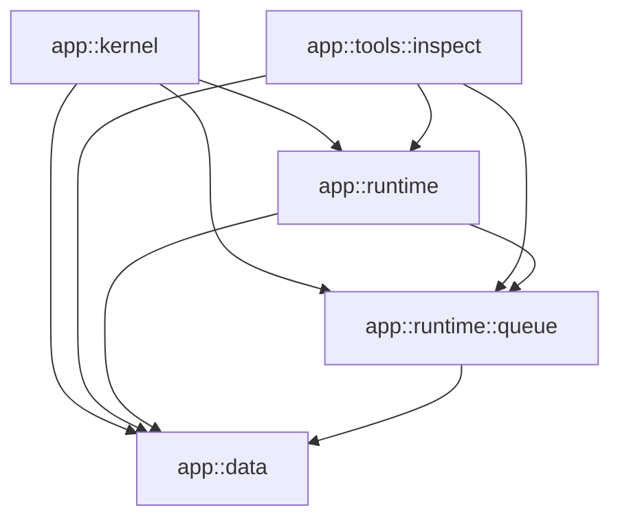

# Two targets over one module graph

This is a complete **source design specimen** for the proposed module system:
every declared function has an implementation, both entries have complete
bodies, and all application dependencies are present. It is not currently an
executable Whitefoot project. The active compiler does not accept `.wfg`,
`.wfm`, qualified module paths, file-local aliases, abstract public structs or
logical getter calls. The proposed forms are identified below; no build
command, successful compiler run or incremental timing is implied.

The application processes two jobs through a four-slot FIFO. The `kernel`
target keeps everything by value and requires `no_heap`. The `inspect` target
runs the same batch and copies its report into a heap cell. Both entries check
the resulting fields and return an `ExitStatus`; neither prints output. The
kernel entry is a small allocation-free workload, not an operating-system
boot image or a target-runtime qualification.

The specimen belongs to the [modular-compilation investigation](../DESIGN.md).
Its reader is evaluating source organization, interface completeness, proof
composition and edit impact. Keep the sources and this walkthrough together;
replace them when the selected syntax or application changes, and remove them
when they no longer expose a useful design question. If this becomes a formal
compiler regression, extract the needed cases into the maintained test system.
It is not a daily CI input.

## Read the project in this order

1. [modules.wfg](modules.wfg): the entire dependency architecture and both
   target declarations.
2. [data.wfm](data.wfm): two public data records and one generic allocating
   function. No field-access wrappers are required for these records.
3. [runtime/queue.wfm](runtime/queue.wfm): the complete abstract queue API,
   including ownership capabilities, the getter and every operation's bounds.
4. [runtime.wfm](runtime.wfm): a client of that API which states its own
   precondition and accepts a function-kind argument with the queue's contract.
5. [kernel/start.wf](kernel/start.wf) and
   [tools/inspect/run.wf](tools/inspect/run.wf): complete uses of the same APIs,
   with different entry requirements and different local abbreviations.
6. [runtime/queue/storage.wf](runtime/queue/storage.wf),
   [runtime/queue/operations.wf](runtime/queue/operations.wf),
   [runtime/batch.wf](runtime/batch.wf),
   [runtime/report.wf](runtime/report.wf) and [data/heap.wf](data/heap.wf):
   the implementation behind those contracts.

The two entry interfaces, [kernel.wfm](kernel.wfm) and
[tools/inspect.wfm](tools/inspect.wfm), contain only their ordinary public
entry declarations. An entry is selected by the graph; it is not a special
function syntax or an implicit `main` name.

```text
demo/
  README.md
  modules.wfg
  data.wfm
  data/
    heap.wf
  runtime.wfm
  runtime/
    batch.wf
    report.wf
    queue.wfm
    queue/
      storage.wf
      operations.wf
  kernel.wfm
  kernel/
    start.wf
  tools/
    inspect.wfm
    inspect/
      run.wf
```

## What the graph says

`root app = ".";` binds `app` to this directory relative to `modules.wfg`,
not relative to the command's working directory. The five module rows register
five exact interfaces. An arrow below means "may use that module's public API";
it is not a runtime call or scheduling edge.



Every listed dependency is an earlier row. That local check certifies the DAG;
the compiler does not infer a desired order from source uses. These rows give
permission, not implicit name imports. An earlier row absent from a module's
list is still unavailable to that module's source.

`runtime` is both a module and a namespace parent. Its implementation consists
of **only** `runtime/batch.wf` and `runtime/report.wf`. It does not collect
`runtime/queue/*.wf`. The separately declared child precedes its parent in
the graph, and the parent's row explicitly grants access. Parenthood grants
no private-field access. `tools` has no `.wfm` and is only a namespace prefix.

The tool reaches across directories to `runtime::queue` without moving that
module to a common ancestor. It lists both `runtime` and `runtime::queue`
because it directly uses both. Removing the latter edge is an error even
though the former still reaches the queue transitively. A future edge from
the queue back to its parent would fail the earlier-row check; retaining both
directions would be a cycle, and row reordering cannot make that legal.

## The public boundary and the private implementation

| Module | What the caller can read in its `.wfm` | Implementation ownership |
|---|---|---|
| `app::data` | All `Job` and `Report` fields; `boxed_copy`'s complete generic signature | `heap.wf` implements the callable and reuses the interface's record declarations |
| `app::runtime::queue` | Capacity, abstract `Queue` capabilities, logical/runtime `len`, constructor, push and pop contracts | `storage.wf` owns the private representation, private constructor helper and getter body; `operations.wf` owns the other public bodies |
| `app::runtime` | `run_two` and the complete required contract of its `take` argument | `batch.wf` calls the private `summarize` in `report.wf` through the shared module inventory |
| `app::kernel` | The selected `start` callable | `start.wf` constructs jobs and a stack-resident queue |
| `app::tools::inspect` | The selected `run` callable | `run.wf` also invokes the shared heap helper |

`Job` and `Report` are copyable, droppable records by their complete public
field schemas. Callers construct them and inspect their fields directly. The
interface schemas are reused inside their owning module; implementation files
do not declare another `Job` or `Report`.

`Queue` is published without fields. Its provisional declaration says exactly
that it is not copyable and can be dropped. The one private definition contains
`Ring<Job, capacity>`, whose capabilities justify that promise for this
nongeneric type. This is the same nominal `Queue`, not a second type. Callers
may own it by value and borrow it, but cannot construct it by fields or name
`storage`. There is no implicit allocation, handle, type invariant or
reference-returning getter. The existing `opaque` modifier is not used as
a privacy mechanism.

`new_storage` is called from a different implementation file without being
declared in `queue.wfm`. Likewise `summarize` is absent from `runtime.wfm`.
All declarations in a module share its inventory, regardless of source-file
order. `capacity`, although declared in the interface, is reused by the
private representation; no duplicated implementation constant can drift.

Each public callable's implementation repeats its full header and contract.
In `queue.wfm` the job type is called `Job`; in `operations.wf` it is called
`Work`. Both aliases resolve directly to `app::data::Job`, so the declarations
must match after resolution. `runtime.wfm` uses an alias for `len`, while
`batch.wf` uses the module alias `fifo`; these also resolve to one callable.
Result and named-argument labels remain the same.

Every file declares its own aliases. An interface alias is not inherited by
its implementations, and `runtime` does not re-export `Queue`, `Job` or `len`.
Clients need their own direct graph edges and aliases. A canonical declaration
identity does not change when one local abbreviation changes.

For concurrent work, one agent can own the queue's interface and implementation
while another owns the batch consumer. An implementation-only edit with the
same checked boundary need not change the other agent's source. API changes
still require coordination with actual consumers; architectural edge changes
meet in `modules.wfg`. The small module sizes here expose those relationships
for reading and are not a recommendation to split production work this finely.

This ownership boundary also does not prescribe one LLVM module or object
per source module. Body proofs and backend partitions have their own tracked
dependencies. Moving a private helper between source files creates no
writer-managed internal link boundary, and final native linking may run in
full. The edit scenarios below describe the desired finer reuse.

## The proof and execution story

The following is the **intended argument**, not a compiler verification result.
The logical getter notation and its missing judgments are described in the
next section.

| Point in either entry | Queue length known from the public contracts | Why the next operation is permitted |
|---|---|---|
| `new` returns | 0 | `0 < capacity`, where the public constant is 4 |
| First `push` returns | 1 | There is room for the second job |
| Second `push` returns | 2 | `run_two` requires at least two jobs |
| First `take` inside `run_two` returns | At least 1 | The first call's length relation proves the second call's precondition |
| Second `take` returns | Entry length minus 2 | This proves `run_two`'s own length relation; these entries reach 0 |

`pop` satisfies the function-kind formal's exact type, effect and length
contract. Supplying `fn fifo::pop` is an ordinary compile-time argument under
the proposed module names; it does not allocate a function object or introduce
dynamic dispatch. Both targets select the same concrete
`runtime::run_two<fn runtime::queue::pop>` instance.

Inside the queue, `len` reads the built-in ring length. The private ring has
capacity 4. A checked realization of that observation would let `push` and
`pop` establish the ordinary `place_back`/`take_front` domains and transfer
their length postconditions. The getter must be verified independently, not
by assuming the relation its callers want to use.

Logical occurrences of `len` in contracts are erased. The occurrence in
`runtime/batch.wf` after both removals is an ordinary runtime call that supplies
the report's `remaining` field. Its result must agree with the observation at
that state. The public `writes(queue)` boundary kills facts about the queue's
old state before each verified postcondition supplies facts about its new
state; an old runtime getter result is not a live reference to future length.
`entry(queue)` denotes the immutable entry observation in an `ensures`, not a
runtime snapshot of the queue.

The FIFO bodies select jobs `(tag: 7, payload: 250)` and
`(tag: 9, payload: 10)` in that order. The private report helper computes an
explicit `+wrap` checksum: `(250 + 10) mod 256 = 4`. The intended report is:

```text
Report(first_tag: 7, second_tag: 9, digest: 4, remaining: 0)
```

Both entries should return exit code **0**. Codes 1, 2, 3 and 4 denote a
mismatched first tag, second tag, digest or remaining count respectively.
These checks test application results; they do not repair a failed source
proof. The written contracts state occupancy safety, not a formal sequence
model of FIFO contents or the exact report fields. The latter expectations
follow from these complete bodies and the ring operations and still need
execution tests once the module path exists.

The kernel's source composition includes `data`, the queue, `runtime` and
`kernel`. Every definition in those modules receives ordinary checking,
including the allocating generic helper's schema. Its conservative execution
closure never selects `boxed_copy`, `Box<Report>` or their release path, so
that helper does not impose a heap requirement on this target. The separate
tool module is not part of the kernel's selected source composition.

The inspect target selects the same three library modules and its own entry.
It instantiates `boxed_copy<Report>`, allocates one report cell and releases it
on every return edge. Both `boxed_copy` and the entry write `pure`, which in
WF does not mean allocation-free. `no_heap` belongs to the kernel target in
the graph, not to any of these reusable modules or functions.

Generated object selection and native/runtime supplies must respect that
distinction as well. An object emitted for the shared module must not force
the kernel to resolve an unused allocator symbol merely because the tool's
helper was compiled. This specimen states that required result; it does not
demonstrate a linker or backend achieving it.

## Proposed notation used here

The graph, module and alias direction comes from the investigation. To make
the unresolved abstract API readable as complete files, this specimen also
uses the following **provisional notation**, without selecting final grammar
or claiming a new proof mechanism is implemented.

| Form in these files | Intended reading | Qualification still required |
|---|---|---|
| `root`, ordered module rows and `target` in `.wfg` | One root binding, exact earlier dependencies, selected entry and optional heap prohibition | Full graph grammar, canonical paths, target/source/execution closure judgments |
| Function header ending in `;` in `.wfm` | A complete public declaration with no executable body | Interface grammar and normalized implementation correspondence |
| `alias short = app::path;` and qualified names | A file-local binding to a canonical module or declaration | Complete strong-LL(2) grammar, lookup domains and collision checks |
| `nocopy struct Queue: drop;` | An abstract public type with the complete capability pair: copy forbidden, drop permitted | Final capability syntax and checked private correspondence; this nongeneric case does not design conditional generic capabilities |
| `observe fn len(...)` | One callable with an ordinary runtime implementation and an admissible total logical observation | Explicit admission, typed interpretation, deterministic finite realization checking and termination grounds; `observe` is only a spelling under evaluation |
| `len(...)` as a contract relation term | The scalar observation at that argument's specified state, with no runtime call | New FN-8/FN-9/ENT term formation and state/support rules; arbitrary function calls remain outside this illustration |
| `len(queue: &made)` in the constructor's `ensures` | Observation of the returned `Queue`, with a proof-only view of that result | Aggregate-result observation, result-binder scope, proof-only borrowing and fact transport through construction, return and binding |
| `len(queue: entry(queue))` | The written reference formal's entry-state observation, used only in `ensures` | Snapshot identity and checked substitution at direct and function-kind calls |

The explicit `observe` marker makes the promised logical use visible in the
self-contained interface. This avoids relying on hidden body discovery or
assuming that every `pure`/read-only function terminates. It supplies no trust:
before any observation is usable, the compiler must check the realization
without that getter's own asserted summary. Here the candidate realization is
one total projection of a built-in ring measure. The eventual language needs
specified admissible derivations, including their interaction with recursive
proof publication; the marker alone does not define them.

For reading this example, observations of the same getter, referent and state
are the same typed scalar term. A write overlapping `queue` invalidates its
live observations; immutable entry observations remain. Construction and
value transfer must preserve the corresponding result observations. A
checked getter call must connect its returned integer to the current
observation. These are obligations for the proposed design, not consequences
of the active specification's existing field rules.

The current FN-8 forbids ordinary calls and borrows in contracts; FN-9 also
does not admit this observation of an arbitrary aggregate result. Naming
these forms explicitly is essential: merely allowing calls to a getter would
not make `new` or its clients well-formed. Likewise `writes(queue)` is a
deliberate whole-object boundary for this tiny FIFO, supported by actual
descendant accesses under EFF-2. It does not settle the more demanding public
effect vocabulary for independent parts of a hidden container.

This is a small client/wrapper/function-kind witness for the desired source
experience. It does not close the investigation's outstanding logical-getter
issue, replace the required GrowVector witness, or prove an incremental
compiler. General capability formulas, precise abstract effects, proof-cache
soundness and backend/runtime qualification remain open.

## Edits to try while reading

These are predicted consequences to qualify in the future implementation,
not measured invalidation results. Each experiment starts from this specimen.

| Edit | Intended source result | Incremental work that must follow |
|---|---|---|
| Rewrite `summarize`'s body with equivalent operations and unchanged header | Public APIs and permissions remain unchanged | Recheck that helper and any affected private summary users; update code importing its implementation, then link. Do not reprove every library solely because one file changed |
| Move `summarize` to another direct `runtime/*.wf` file, preserving its resolved aliases | Same private declaration identity; still callable from `batch.wf` | Refresh file membership and locations; reuse semantic work only when the resolved declaration/context and dependencies are unchanged |
| Rename the `Work` alias in `report.wf`, updating its uses | Same canonical type, no change in other files | Refresh that file's formation/resolution; normalized semantic results may remain reusable |
| Change the private `Queue` representation while preserving its checked interface | Clients still cannot name the fields | Recheck representation/capabilities, getter realization and affected bodies; recompile actual layout/release/ABI and optimizer consumers even if source proofs remain reusable |
| Change `Report`'s public field schema | Callers may need source changes | Revalidate schema, field/type/ownership users and layout/codegen consumers; publication is a real dependency |
| Delete `app::kernel`'s direct queue edge while keeping its runtime edge | Reject the kernel's queue aliases/uses | Revalidate the edge/lookup consumers; transitive reachability grants no source permission |
| Change only the tool's aliases or body | Kernel source proofs are unchanged when their actual inputs are unchanged | Recheck tool consumers and its changed specialization/optimizer dependencies; no blanket graph-file or target key should reprove all shared bodies |
| Add `no_heap;` to `target inspect` | Reject its reachable `boxed_copy<Report>`/`Box<Report>` heap requirement | Recheck target composition against shared heap summaries; do not reinterpret every function's ordinary proof |
| Add the same storing call to `kernel/start.wf` | Reject the kernel's reachable allocation before optimization | Recheck the changed body, concrete execution closure and target requirement; optimizer deletion is not permission |
| Change an unselected allocating helper to contain an unproved partial operation | Reject the selected module's ordinary source checking | No-heap reachability is not an exemption from source safety |

For additional rejection probes, try calling `fifo::new_storage` externally,
naming `pending.storage`, changing only `push`'s implementation contract,
placing the getter body in `.wfm`, or adding an edge to a later graph row.
Each should fail for that specific boundary; an unrelated earlier syntax
failure is not evidence for it. These are review exercises until the real
compiler implements the proposed forms.

The eventual executable qualification must check both targets, the rejection
probes, no allocator dependency in the kernel artifact, and cold/incremental
agreement for these edits. The current validation is source/design review
and repository structural checks only. There are no module compilation,
execution, runtime-performance or incremental-work measurements here.
